

 
 
 

# 自然資本ロケーション評価レポート

## 概要

拠点名：下山工場 
国：日本 
緯度：35.063829 
経度：137.091762 
作成日：2023/10/04 
Created by Think Nature 

## 自然資本ロケーション評価レポートとは

自然資本ロケーション評価レポートとは、評価対象エリアについて、生物多様性の重要性や、生態系の変化（劣化）、水リスクなどの観点から評価したレポートです。TNFD（自然関連財務情報開示タスクフォース）の提示するLEAPアプローチのL（Locate）に該当する評価結果を示しています。

## 評価対象項目一覧

| No  | 項目名                                               | 評価指標の概要                                                                                  | 
| --- | ---------------------------------------------------- | ----------------------------------------------------------------------------------------------- | 
| 1   | バイオーム（Biome）                                  | 熱帯雨林、ツンドラ、砂漠など、主に気候によって分けられる生態系の大分類                          | 
| 2   | エコリージョン（Ecoregion）                          | 土壌・気候・植生等が類似するバイオームより詳細な生態系の地理的単位                              | 
| 3   | 生物多様性の重要性（Biodiversity importance）        | 脊椎動物と樹木の種組成の観点から計算した、各地点の生物多様性の重要性を示した指標                | 
| 4   | 生物多様性の重要性-分類群（Biodiversity importance） | 分類群毎の生物多様性の重要性の指標および種数                                                    | 
| 5   | 生物多様性の完全性 （Biodiversity Intactness）       | 生態系および自然林の分布データをもとに生態系の状態（原生自然にどれだけ近いか）を指標化したもの  | 
| 6   | 森林面積変化 （Forest area change）                  | 各グリッド（周囲約15km）を森林が占める割合の過去20年での変化量                                  | 
| 7   | 人間活動量変化 （Human footprint increase）          | 様々な人間活動による環境への影響の近年の増減量（フットプリント増減）                            | 
| 8   | 水質汚染度 （Water pollution）                       | 水質汚染の代表的指標であるBOD（生物化学的酸素要求量：水中の有機物を分解する際に必要な酸素の量） | 
| 9   | 洪水頻度 （Flood Frequency）                         | 1985年から2021年の間に洪水により影響を受けた回数                                                | 
| 10  | 水不足度 （Water shortage）                          | 水の需要供給バランスから利用可能な水量を導出した指標（AWARE Index）                             | 

## No.1 バイオーム（Biome）

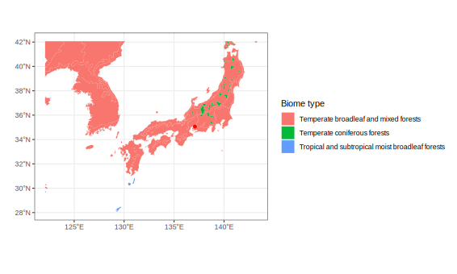

【下山工場】は【温帯広葉混交樹林（Temperate broadleaf and mixed forests）】に位置しています。

## No.2 エコリージョン（Ecoregion）

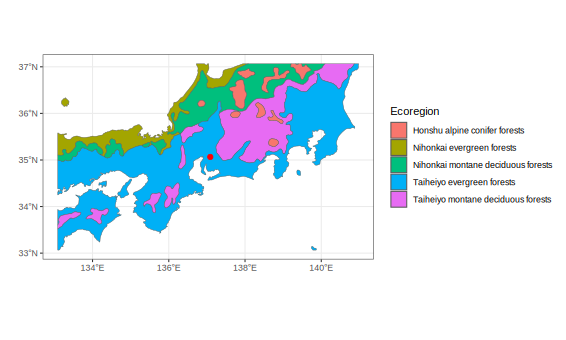

【下山工場】は【太平洋沿岸常緑樹林（Taiheiyo evergreen forests）】に位置しています。

## No.3 生物多様性の重要性（Biodiversity importance）

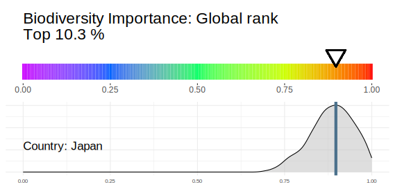

【下山工場】の生物多様性の重要度は、世界的に見て上位【10.3】％であり、重要性が【高い】エリアであると言えます。

## No.4 生物多様性の重要性（分類群）（Biodiversity importance）

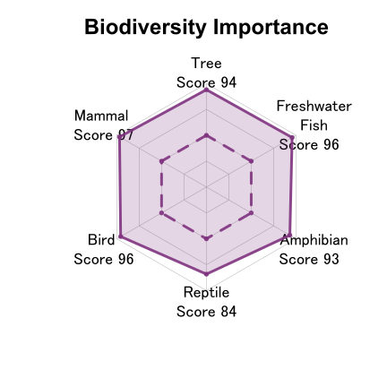
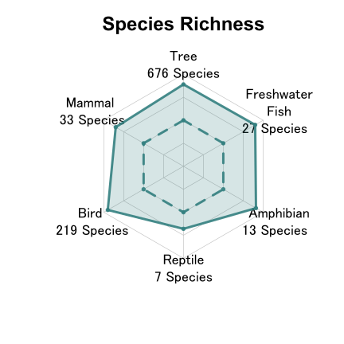

【下山工場】周辺の生物多様性の重要度を分類群ごとにみると、各分類群のスコアは樹木【94】、淡水魚【96】、両生類【93】、爬虫類【84】、鳥類【96】、哺乳類【97】となり、【哺乳類】のスコアが最も高く、【哺乳類】にとって重要なエリアであることが分かります。 
また、それぞれの種数は樹木【676】種、淡水魚【27】種、両生類【13】種、爬虫類【7】種、鳥類【219】種、哺乳類【33】種となっており、【鳥類】の種数が他地域と比較して多いエリアとなっています。

## No.5 生物多様性の完全性（Biodiversity intactness）

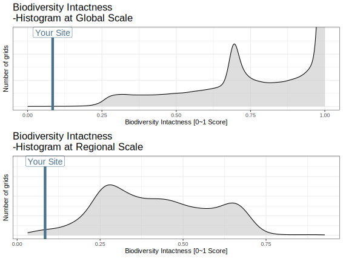

【下山工場】の生態系の完全性は、世界的に見て上位【99】％であり、自然度が【低い】エリアであると言えます。また、【日本】国内では、上位【98.6】％であり、自然度が【低い】エリアであると言えます。

## No.6 森林面積変化（Forest area change）

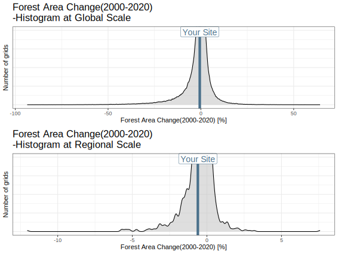

【下山工場】周辺の森林面積の変化は、世界的に見て上位【80.9】％であり、森林破壊のリスクが【高い】エリアであると言えます。また、【日本】国内では、上位【74.1】％であり、森林破壊のリスクが【高い】エリアであると言えます。

## No.7 人間活動量変化（Human footprint increase）

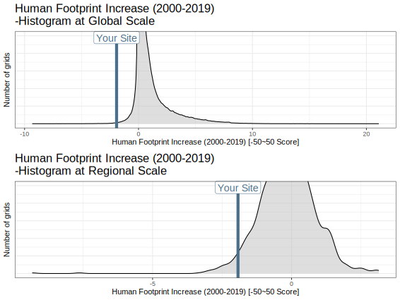

【下山工場】の人間活動量の増加率は、世界的に見て上位【99.8】％であり、人間活動による生態系の喪失リスクが【低い】エリアであると言えます。また、【日本】国内では、上位【97.0】％であり、人間活動による生態系の喪失リスクが【低い】エリアであると言えます。

## No.8 水質汚染（Water pollution）

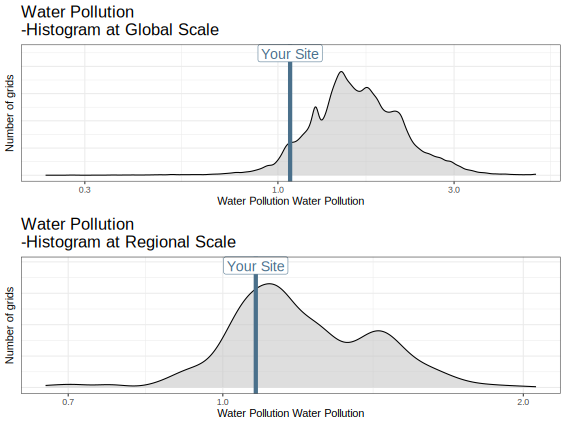

【下山工場】の水質汚染は、世界的に見て上位【93.3】％であり、水質汚染の程度が【低い】エリアであると言えます。また、【日本】国内では、上位【72.8】％であり、水質汚染の程度が【低い】エリアであると言えます。

## No.9 洪水頻度（Flood Frequency）

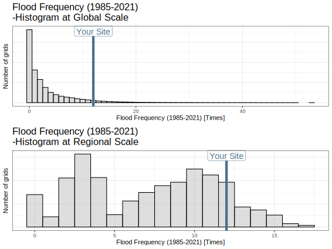

【下山工場】の洪水頻度は、世界的に見て上位【6.1】％であり、洪水が発生する可能性が【高い】エリアであると言えます。また、【日本】国内では、上位【16.7】％であり、洪水が発生する可能性が【高い】エリアであると言えます。

## No.10 水不足度（Water shortage）

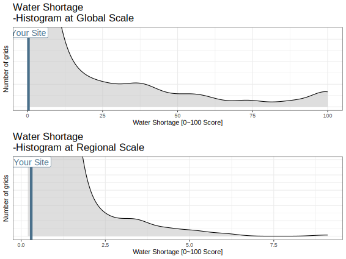

【下山工場】の水不足度は、世界的に見て上位【94.9】％であり、水不足に陥る可能性が【低い】エリアであると言えます。また、【日本】国内では、上位【90.2】％であり、水不足に陥る可能性が【低い】エリアであると言えます。

